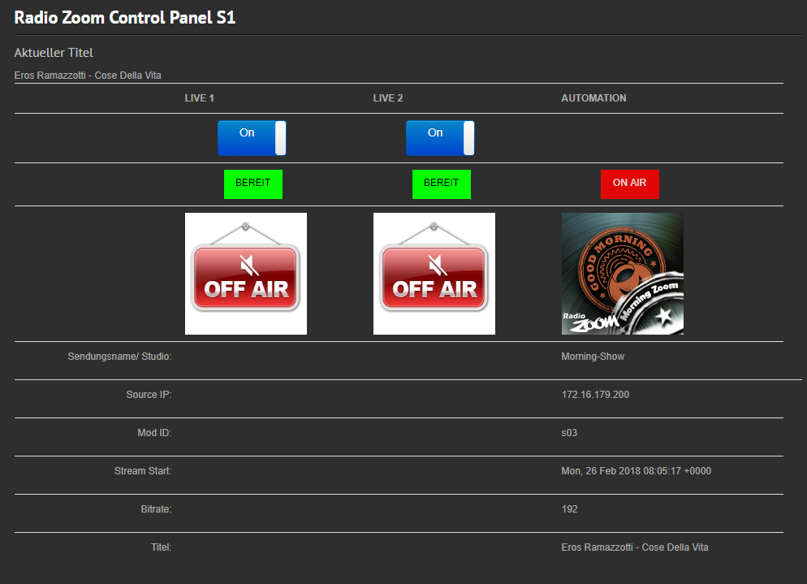

# mairlist-html-control by Radio-Zoom
The mAirlist html control panel can control many functions of the famous mAirlist Radio Automation Software.
The Sofware can be found on https://mairlist.com

Our development is based on the REST Interface of the PRO Edition, and startet based on Version 6.0

It's primary focus is the easy control for the Radio DJs of [Radio-Zoom](https://www.radio-zoom.de/) To the Radio Automation.

